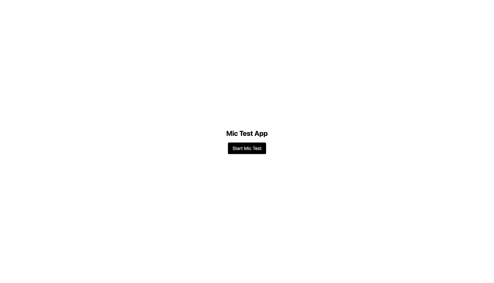
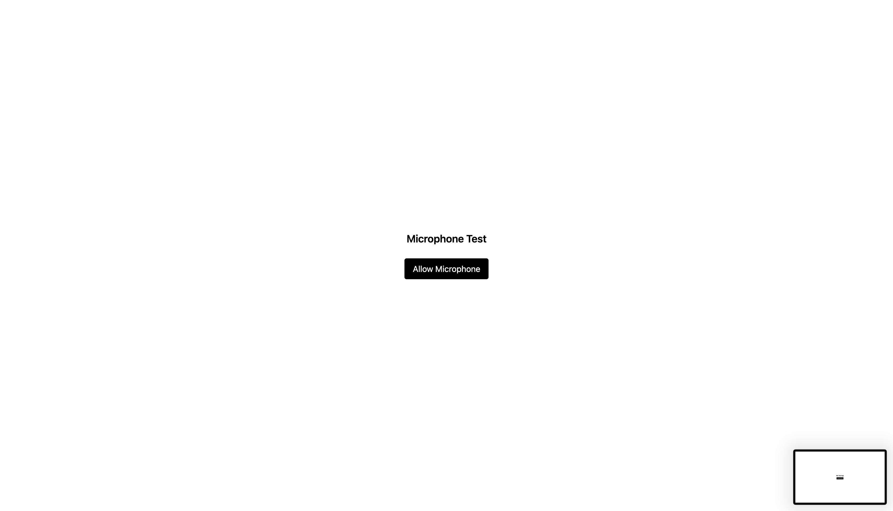
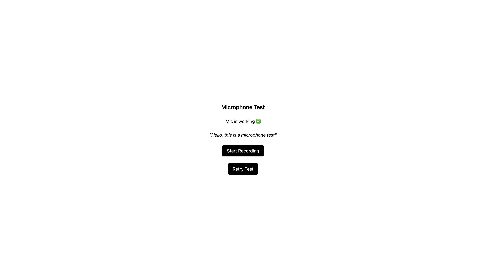
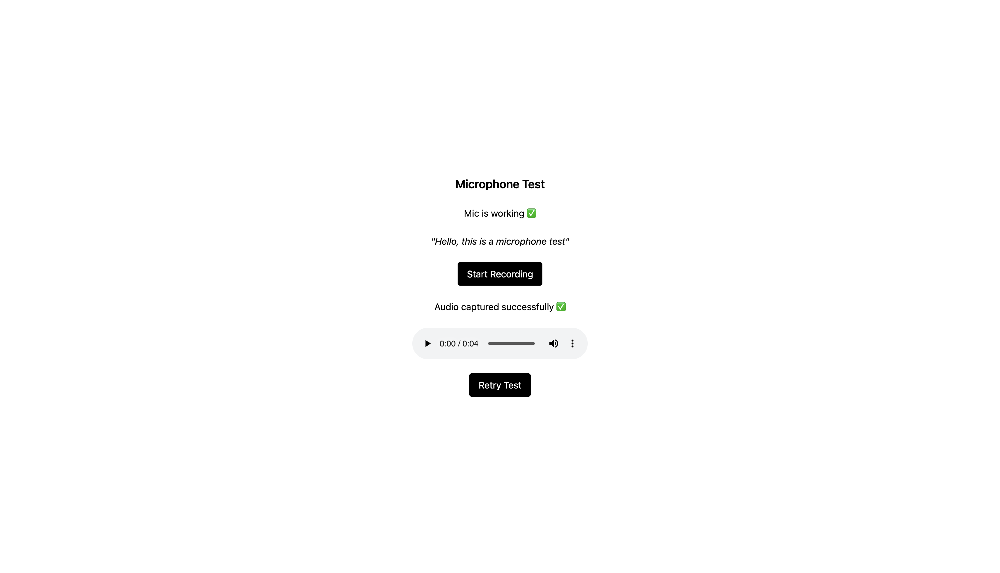

Mic Test App

A simple frontend microphone testing application built as part of a shortlisting task.
The app checks microphone access, records a short audio clip, and allows playback — all using browser APIs.

⸻
Setup Instructions

Steps

# Clone the repository
git clone <your-repo-url>

# Go to project directory
cd mic-test-app

# Install dependencies
npm install

# Start development server
npm run dev

⸻

🎧 How Mic Testing Works
	1.	User grants microphone permission
	•	The app uses navigator.mediaDevices.getUserMedia({ audio: true })
	•	If permission is denied, an error message is shown.
	2.	Microphone stream is activated
	•	Once permission is granted, the browser provides a live audio stream.
	3.	Audio recording starts
	•	The app uses the MediaRecorder API.
	•	Recording automatically stops after 5 seconds.
	4.	Audio playback
	•	Recorded audio chunks are combined into a Blob.
	•	A local playback URL is created using URL.createObjectURL.
	•	The user can listen to the recorded audio directly in the browser.
	5.	Retry option
	•	Users can restart the test to record again.

⸻

Screenshots

⸻
 Known Limitations
	•	Audio is recorded locally in the browser only.
	•	Recorded audio is not uploaded or stored anywhere.
	•	No audio waveform or visualizer is included.
	•	Recording duration is fixed to 5 seconds.
	•	MediaRecorder support depends on browser compatibility (works best in Chrome).

⸻
 Tech Stack
	•	React (Vite)
	•	Tailwind CSS
	•	Web Media APIs (getUserMedia, MediaRecorder)

